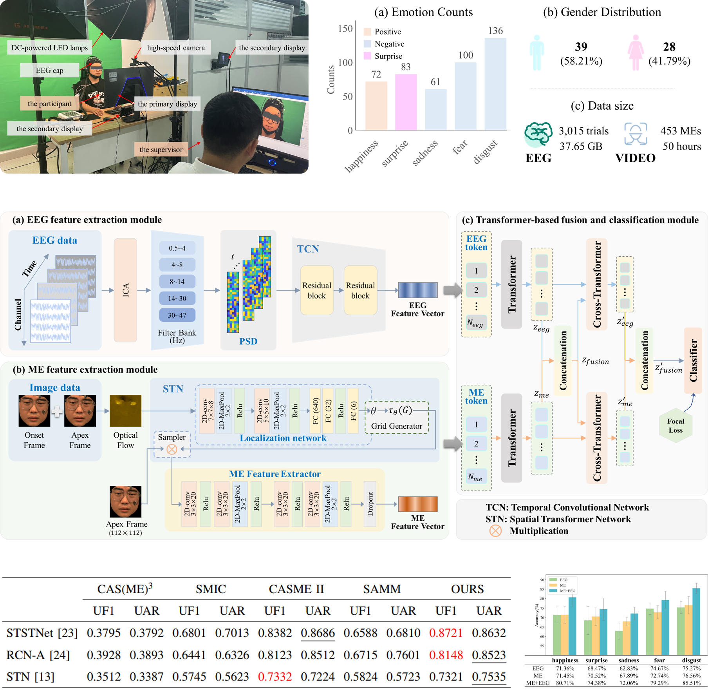

# Multi-modality Hidden Emotion Recognition via Electroencephalogram and Facial Micro-expressions

# Introduction

With the development of multimedia technology, emotion recognition has gradually matured, but hidden emotion recognition still faces numerous challenges. Given the unique advantages of micro-expressions (MEs) and electroencephalogram (EEG) signals in capturing subtle emotional cues, we recreated scenarios where individuals suppress facial expressions to conceal emotions in response to intense emotional stimuli. Simultaneous recording of MEs and EEG data from 67 participants resulted in a dataset comprising 453 ME video clips and 3,015 EEG trials across five emotional categories. To assess the dataset’s reliability, we developed an emotion classification model utilizing cross-modal attention mechanisms, achieving 80.46\% accuracy in classifying hidden emotions across the five categories. This method outperforms approaches relying solely on MEs or EEG by 9.83\% and 6.94\%, respectively. To the best of our knowledge, this is the first publicly available dataset that includes both MEs and EEG data, which will be available at: https://github.com/Mac0504/MEs-EEG.

# Samples

# Experimental Scene and Results

# How to get

This database is publicly available for any academic use. To obtain it, please sign the release agreement and send a scanned copy to ustb_machuang@163.com.
