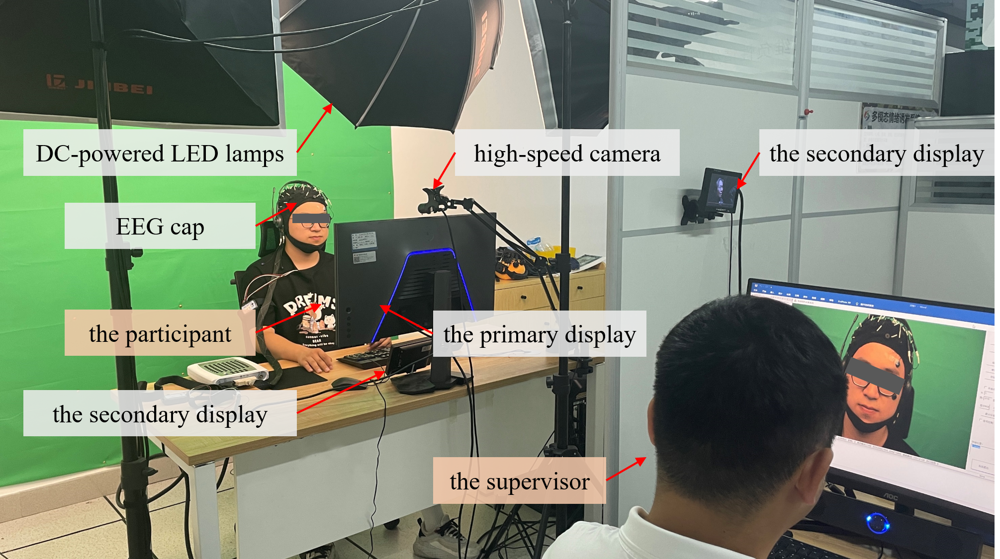
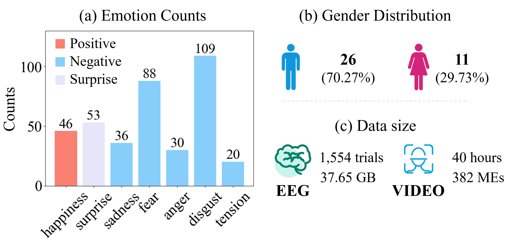
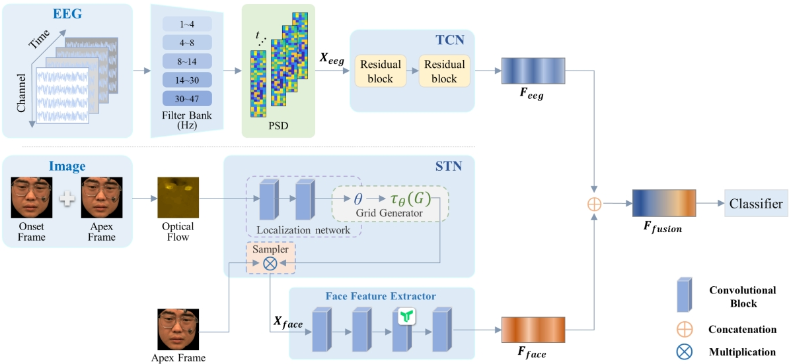

# Multi-modality Hidden Emotion Recognition via Electroencephalogram and Facial Micro-expressions

# Introduction

Emotions are inherently multimodal processes, with facial expressions playing a crucial role in emotional communication. Numerous scholars have begun to integrate facial expression with physiological signals, demonstrating their complementary nature. However, when individuals attempt to conceal their genuine emotions, they often strive to maintain a neutral facial expression, rendering visual cues ineffective. This study reconstructs scenarios in which humans, under intense emotional stimuli, attempt to suppress their facial expressions to hide their emotions. We synchronized the recording of participants' electroencephalogram (EEG) data with fleeting facial signals, known as micro-expressions (MEs), to create a dataset suitable for recognizing hidden emotions. This dataset includes 1,554 trials of EEG data and 382 ME samples from 37 participants, covering seven emotional categories.

# How to get

This database is publicly available for any academic use. To obtain it, please sign the license agreement and send a scanned copy to ustb_machuang@163.com.
