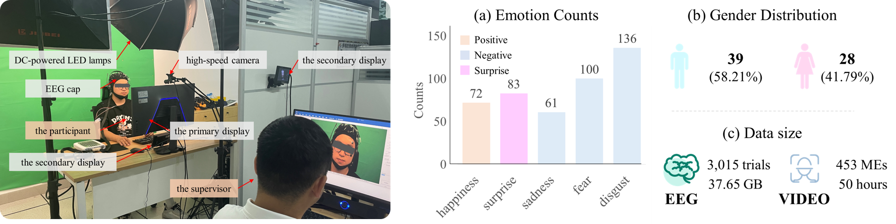
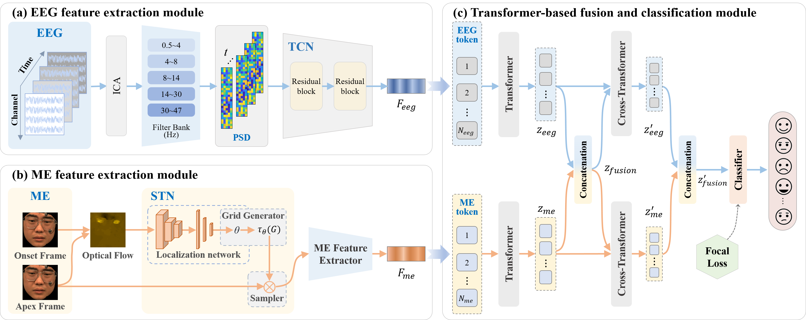
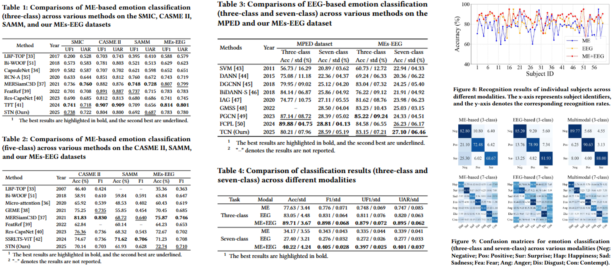
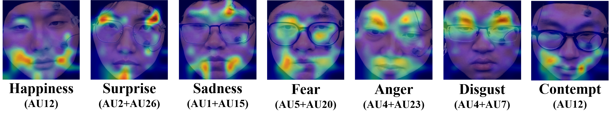

# A Transformer-Based Multimodal Framework for Hidden Emotion Recognition through Micro-Expression and EEG Fusion

# Abstract

With the development of multimedia technology, emotion recognition has gradually matured, but hidden emotion recognition still faces numerous challenges. Given the unique advantages of micro-expressions (MEs) and electroencephalogram (EEG) signals in capturing subtle emotional cues, we recreated scenarios where individuals suppress facial expressions to conceal emotions in response to intense emotional stimuli. Simultaneous recording of MEs and EEG data from 60 participants resulted in a dataset comprising 453 ME video clips and 2,940 EEG trials across seven emotional categories. To evaluate the reliability of the dataset, we developed an emotion classification model utilizing a cross-modal attention mechanism. The model achieved an accuracy of 89.71% for three-class classification and 40.22% for seven-class classification, demonstrating a significant performance improvement compared to single-modal approaches. To the best of our knowledge, this is the first publicly available dataset that includes both MEs and EEG data.

# Samples

# Experimental Scene and Results

We simultaneously recorded facial videos and EEG data from 60 participants. Following meticulous annotation, we constructed a dataset comprising 453 micro-expression (ME) video clips and 2,940 EEG trials, covering seven emotional categories.

The overview structure of our proposed MEs-EEG fusion and classification network has a dual-stream architecture and includes three components. 

Pipeline: (1) EEG feature extraction module. The EEG signals underwent preprocessing steps including downsampling, independent component analysis (ICA), and filtering. The resulting power spectral densities (PSDs) of five classical frequency bands were fed into a Temporal Convolutional Network (TCN) to extract advanced features, as shown in (a). 

(2) For ME samples, the optical flow between the onset and apex frames was computed. A Spatial Transformer Network (STN) was then employed to extract visual features from key facial regions, as shown in (b). 

(3) Transformer-based fusion and classification module. A fusion and classification model leveraging cross-modal attention was developed to facilitate information exchange between the two modalities via a Cross-Transformer. To address the issue of class imbalance in hidden emotion classification, the focal loss function was applied, as shown in (c).

This study constructed a multimodal dataset for hidden emotion recognition that incorporates EEG and MEs, exceeding most publicly available ME datasets in both sample size and emotional categories. To evaluate the dataset's reliability, we utilized a STN to extract features from ME images and a TCN to derive features from EEG signals. Subsequently, we performed feature fusion and emotion classification based on the cross-modal attention mechanism. The model achieved an accuracy of 89.71\% for three-class classification and 40.22\% for seven-class classification, demonstrating a significant performance improvement compared to single-modal approaches. Our study not only offers a novel perspective on emotion recognition but also provides significant data support for the development of more accurate emotional recognition technologies. In the future, we will continue to improve this dataset, with a focus on addressing the issue of class imbalance.

